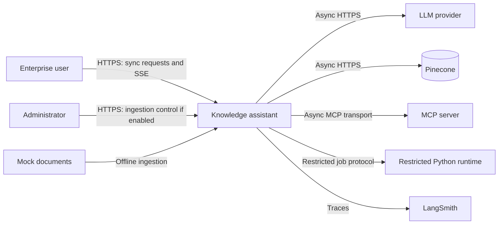
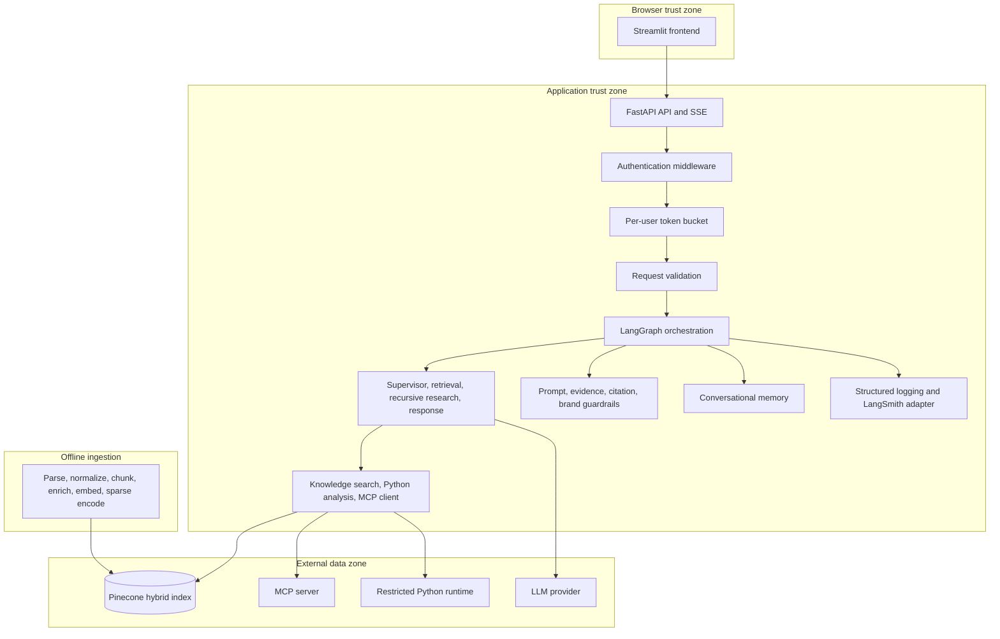
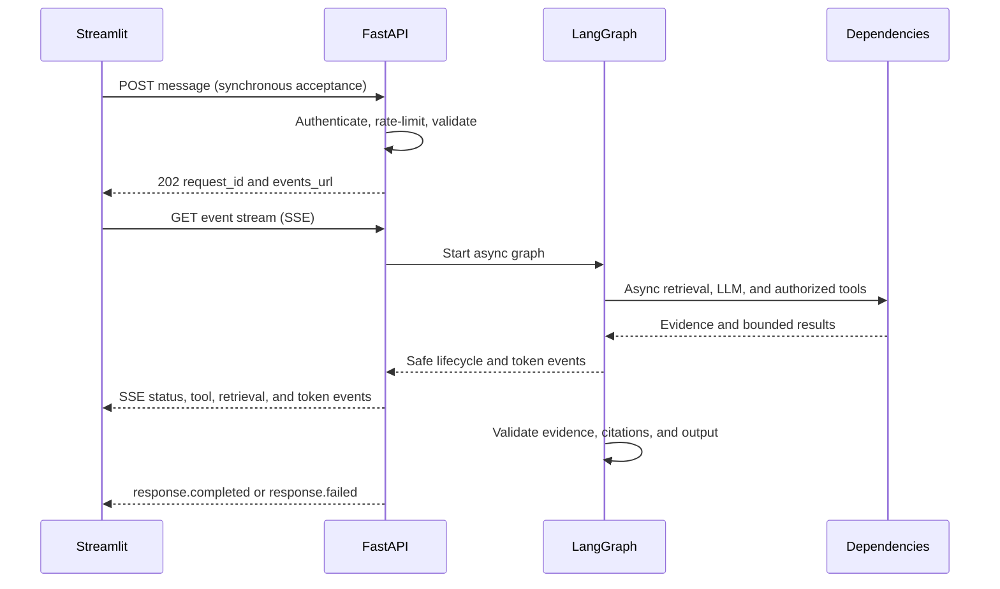
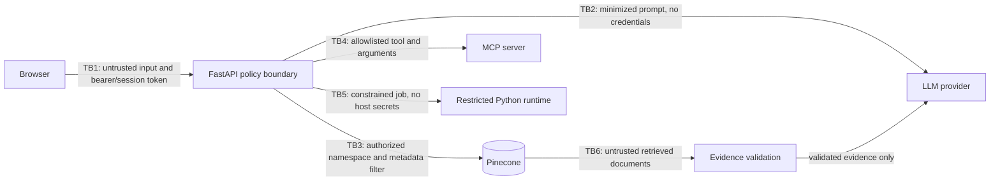
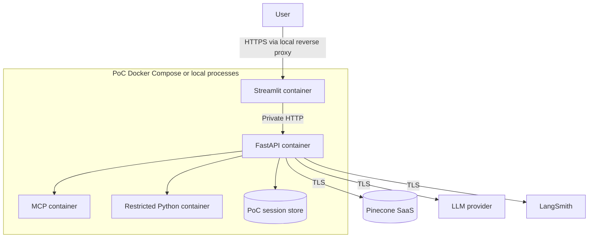

# Proposed Architecture

Status: **Partially implemented.** Foundations, ingestion, optional Pinecone dense retrieval, local BM25 sparse retrieval, and backend hybrid fusion now run. Reranking, graph, tool, memory, LLM, SSE, and UI integrations remain planned. Pinecone remains explicit and is not initialized during API startup.

## Architectural principles

- Keep the modular monorepo and deploy the PoC as a small number of containers; do not create a microservice per agent.
- FastAPI is the policy-enforcement boundary. LLM output can propose actions but cannot grant authorization.
- Retrieved documents are **untrusted data**. They never become instructions and are validated before entering model context.
- Use async I/O for LLM, Pinecone, MCP, memory, and tool calls; use synchronous code for local validation and deterministic policy checks; use Server-Sent Events (SSE) for one-way streaming; run ingestion offline.
- Emit structured operational summaries, never private chain-of-thought.

## System context (proposed)

External dependencies are the LLM provider, Pinecone, LangSmith, and any separately deployed MCP or restricted-runtime service. The browser never calls them directly.

## Container and component architecture (proposed)

The Streamlit container owns presentation only. FastAPI owns schemas, identity, authorization, budgets, graph execution, event projection, and error mapping. LangGraph coordinates agent roles; agents do not become independently deployed services. The MCP server is separate only where its tool boundary or lifecycle requires it.

## Request lifecycle (proposed)

Health and session reads are synchronous HTTP operations. Message processing is asynchronous after acceptance. Tokens and safe agent activity are streaming operations. Ingestion is offline and never runs in the interactive request path.

## Trust boundaries (proposed)

| Boundary | Required controls |
|---|---|
| Browser → FastAPI | TLS, authentication, CSRF/session controls as applicable, schema and size validation, per-user rate limits, safe errors. |
| FastAPI → LLM provider | Secret isolation, egress allowlist, timeout/retry budget, minimized prompts, provider data-retention configuration. |
| FastAPI → Pinecone | Server-side credentials, role-derived namespace/filter, timeout, result validation, audit metadata. |
| FastAPI → MCP server | Tool allowlist, per-call authorization, argument schema, timeout, output validation, transport authentication. |
| Application → restricted Python runtime | No arbitrary host execution, immutable image, resource/time limits, no secrets or network by default, sanitized data transfer. |
| Retrieved documents → model context | Treat as untrusted data, enforce access filters first, detect instructions, delimit content, preserve provenance, validate citations. |

## Deployment topology (proposed)

The implemented PoC token bucket uses per-bucket async locks and bounded opportunistic TTL cleanup. It is process-local, resets on restart, and cannot coordinate multiple workers. Production should use an atomic Redis Lua script or equivalent transaction plus a managed identity provider, distributed session storage, secrets manager, network policies, horizontally scalable API workers, durable event/session persistence, isolated analysis jobs, and centralized telemetry.

## Responsibility summary

Authentication middleware establishes identity; RBAC maps identity to roles and scopes; the token bucket protects per-user capacity; request validation normalizes safe inputs. LangGraph routes simple questions to retrieval and complex questions to bounded recursive research. The knowledge-search tool performs authorized hybrid retrieval, while Python and MCP calls require separate authorization. Conversational memory supplies bounded session context. Guardrails inspect input, untrusted evidence, citations, and final responses. LangSmith records traces and structured logging records allowlisted operational fields. SSE projects only safe public events to the UI.

Detailed contracts are in [graph design](graph-design.md), [retrieval design](retrieval-design.md), [API contracts](api-contracts.md), [event stream design](event-stream-design.md), and [error handling](error-handling-design.md).
