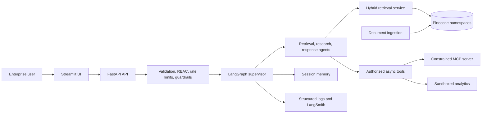
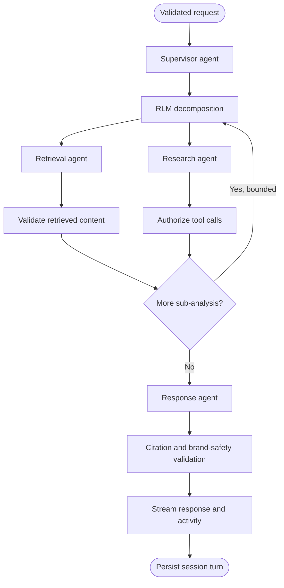

# Proposed Architecture

This document describes the intended architecture. Except for the FastAPI health baseline, JSON logging, configuration, and Streamlit placeholder, these components are not implemented.

## Proposed high-level architecture

The API will own trust-boundary enforcement and orchestration. Streamlit will remain a presentation client and will not duplicate authorization, retrieval, or agent logic. Ingestion will validate, normalize, chunk, and index mock organizational documents. The MCP service will expose a deliberately narrow tool surface.

## Proposed preliminary LangGraph flow

Cycles will be bounded by depth, time, and token budgets. Authorization will be deterministic backend code, not an LLM instruction. Retrieved content will be untrusted and isolated from system instructions. Failure paths, timeouts, and human review points will be added as the corresponding features are implemented.
