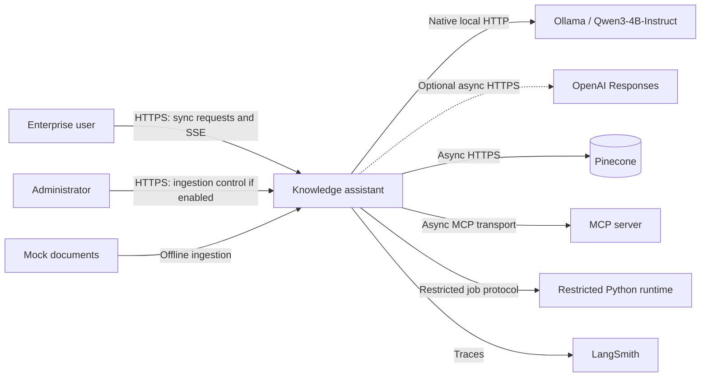
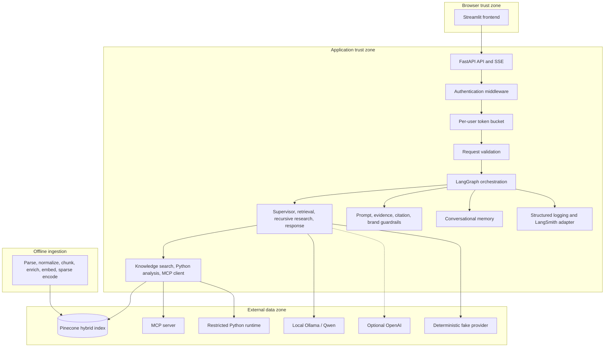
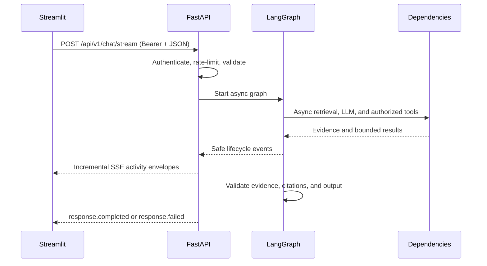
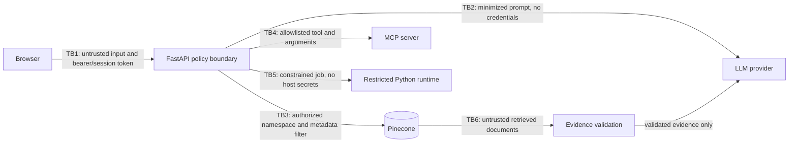
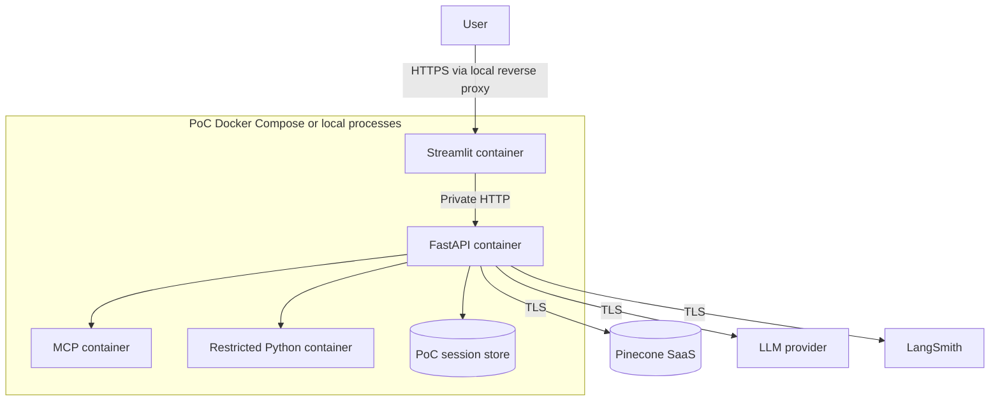

# Proposed Architecture

Status: **Partially implemented.** Foundations, retrieval, graph orchestration, grounded generation,
MCP and restricted analysis, bounded process-local memory, FastAPI JSON/SSE delivery, and the
Streamlit UI now run. Durable/distributed or semantic memory, human approval, and reranking remain
planned. Conversation memory is a replaceable store boundary distinct from the LangGraph
checkpointer; see [session memory](session-memory-design.md).

The consolidated reviewer diagram is
[the final assessment architecture](final-architecture.md). `Dockerfile` and `compose.yaml`
package the implemented API and UI as a local two-service PoC. Compose configuration is validated;
the final image also passed a local build/start/API health/UI health/down lifecycle. This does not
imply production orchestration.

The restricted analysis boundary maps typed operations to trusted standard-library functions over
manifest-authorized incident rows. It is not a code-execution sandbox.
Grounded response generation depends on an application provider protocol. Local manual assessment
uses native Ollama with schema-constrained `qwen3:4b-instruct`; fake remains the CI default and
OpenAI Responses remains optional. Retrieval, authorization, structured output, and citation
metadata remain application-owned.

## Architectural principles

- Keep the modular monorepo and deploy the PoC as a small number of containers; do not create a microservice per agent.
- FastAPI is the policy-enforcement boundary. LLM output can propose actions but cannot grant authorization.
- Retrieved documents are **untrusted data**. They never become instructions and are validated before entering model context.
- Use async I/O for LLM, Pinecone, MCP, memory, and tool calls; use synchronous code for local validation and deterministic policy checks; use Server-Sent Events (SSE) for one-way streaming; run ingestion offline.
- Emit structured operational summaries, never private chain-of-thought.

## System context

The local Ollama runtime is a separate local generation boundary. Optional external dependencies
are OpenAI, Pinecone, and LangSmith. The browser never calls any provider directly.

## Component architecture

The Streamlit container owns presentation only. FastAPI owns schemas, identity, authorization,
budgets, graph execution, event projection, and error mapping. LangGraph coordinates agent roles;
agents do not become independently deployed services. Qwen is pretrained: enterprise documents
are indexed for RAG and updated by re-ingestion/re-indexing, not model retraining.

## Implemented interactive request lifecycle

Login and health calls are ordinary HTTP operations. The chat POST remains open while asynchronous
graph work emits safe activity and one final output. Unvalidated model tokens are not streamed.
Ingestion is offline and never runs in the interactive request path.

## Trust boundaries

| Boundary | Required controls |
|---|---|
| Browser → FastAPI | TLS, authentication, CSRF/session controls as applicable, schema and size validation, per-user rate limits, safe errors. |
| FastAPI → LLM provider | Secret isolation, egress allowlist, timeout/retry budget, minimized prompts, provider data-retention configuration. |
| FastAPI → Pinecone | Server-side credentials, role-derived namespace/filter, timeout, result validation, audit metadata. |
| FastAPI → MCP server | Tool allowlist, per-call authorization, argument schema, timeout, output validation, transport authentication. |
| Application → restricted Python runtime | No arbitrary host execution, immutable image, resource/time limits, no secrets or network by default, sanitized data transfer. |
| Retrieved documents → model context | Treat as untrusted data, enforce access filters first, detect instructions, delimit content, preserve provenance, validate citations. |

## Deployment topology (proposed)

The implemented PoC token bucket uses per-bucket async locks and bounded opportunistic TTL cleanup. It is process-local, resets on restart, and cannot coordinate multiple workers. Production should use an atomic Redis Lua script or equivalent transaction plus a managed identity provider, distributed session storage, secrets manager, network policies, horizontally scalable API workers, durable event/session persistence, isolated analysis jobs, and centralized telemetry.

## Responsibility summary

Authentication middleware establishes identity; RBAC maps identity to roles and scopes; the token bucket protects per-user capacity; request validation normalizes safe inputs. LangGraph routes simple questions to retrieval and complex questions to bounded recursive research. The knowledge-search tool performs authorized hybrid retrieval, while Python and MCP calls require separate authorization. Conversational memory supplies bounded session context. Guardrails inspect input, untrusted evidence, citations, and final responses. LangSmith records traces and structured logging records allowlisted operational fields. SSE projects only safe public events to the UI.

Detailed contracts are in [graph design](graph-design.md), [retrieval design](retrieval-design.md), [API contracts](api-contracts.md), [event stream design](event-stream-design.md), [chat/SSE design](fastapi-chat-sse-design.md), and [error handling](error-handling-design.md).

Graph 1.2 implements bounded research and a constrained MCP route as a compiled `StateGraph`. MCP
service data crosses a local official-SDK client/server boundary and is converted immediately into
application-owned models; the host authorizes before opening the in-memory transport. FastAPI
lifespan owns one shared runtime exposed through authenticated JSON and native POST SSE endpoints.
Streamlit owns only authentication presentation, multi-turn display, incremental public-event
validation, and safe answer/activity rendering. Durable distributed workers, remote MCP
transport/OAuth, human approval, and reranking are not implemented.
