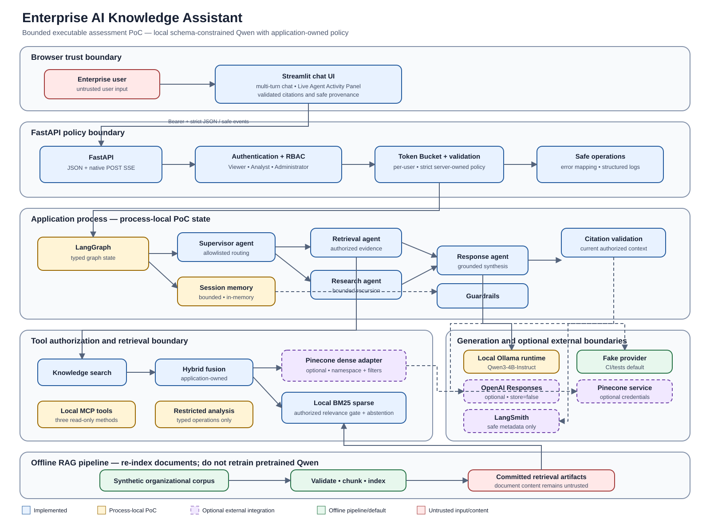
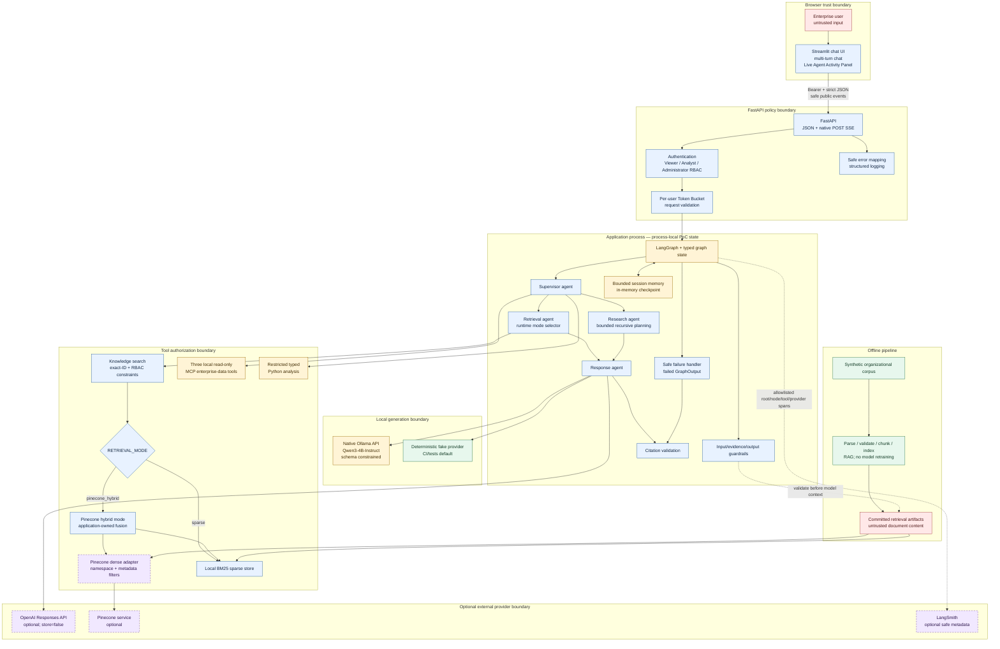

# Final Assessment Architecture

Status: **Implemented bounded assessment PoC with optional external integrations.**

The diagram distinguishes executable local components from optional provider adapters and
process-local state. The FastAPI boundary owns identity, authorization, quotas, routing inputs,
tool permissions, and public error/event projection. Neither the browser, retrieved documents, nor
an LLM can grant permissions.

## Renderable Mermaid source

## Trust and deployment notes

- The Streamlit browser session is presentation-only. It cannot supply roles, permissions, routes,
  namespaces, filters, tools, or policy.
- FastAPI derives identity from the validated bearer token in authenticated local mode and applies
  RBAC again at retrieval and tool boundaries.
- Retrieved text is untrusted data. Authorization, integrity, instruction-content, and citation
  checks occur before final response completion.
- MCP and restricted analysis are local application boundaries, not separately deployed remote
  services. No OAuth-enabled remote MCP service is claimed.
- Session memory, LangGraph checkpointing, and rate-limit buckets are process-local and reset when
  the API container restarts.
- Local manual assessment uses native Ollama with `qwen3:4b-instruct`; CI and infrastructure smoke
  use the deterministic fake provider. OpenAI, Pinecone, and LangSmith remain disabled unless the
  reviewer explicitly selects them and supplies required runtime credentials.
- Qwen is pretrained. Enterprise documents are indexed for RAG; updating them requires
  re-ingestion/re-indexing, not model retraining.
- `RETRIEVAL_MODE=sparse` constructs only the local BM25 adapter.
  `RETRIEVAL_MODE=pinecone_hybrid` requires enabled Pinecone configuration and constructs the real
  Pinecone dense branch plus local BM25 fusion in the FastAPI runtime. Live provider proof remains
  credential-dependent.
- Offline ingestion creates the committed artifacts used by local retrieval; it is not part of the
  interactive container request path.
