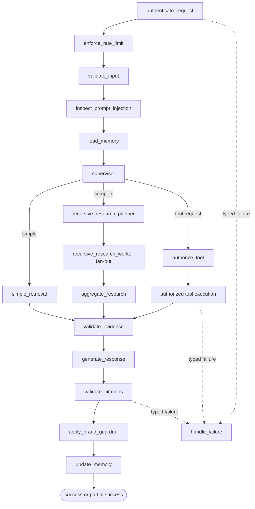
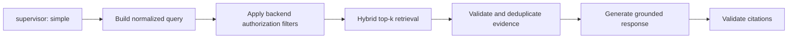
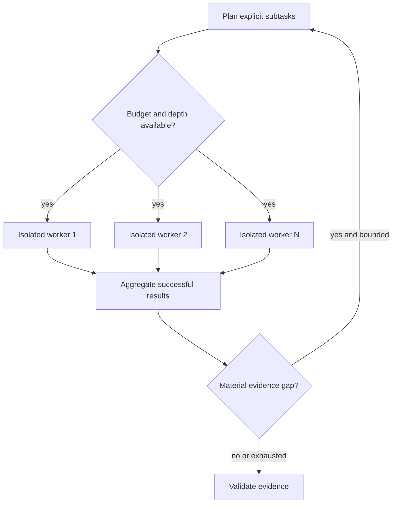
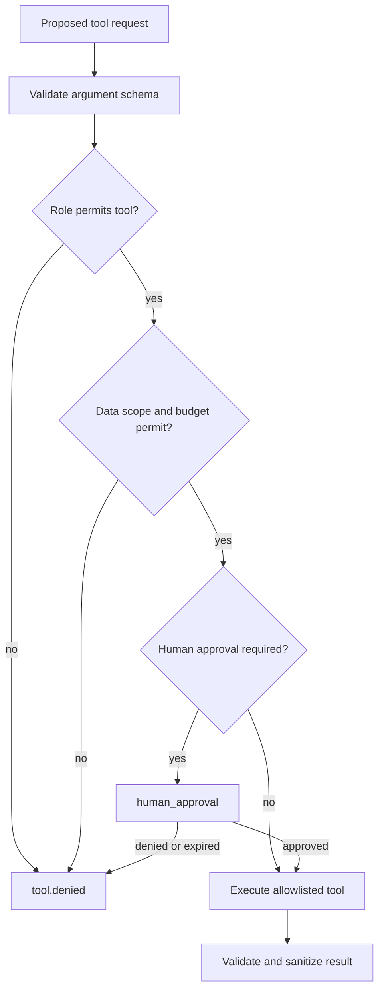
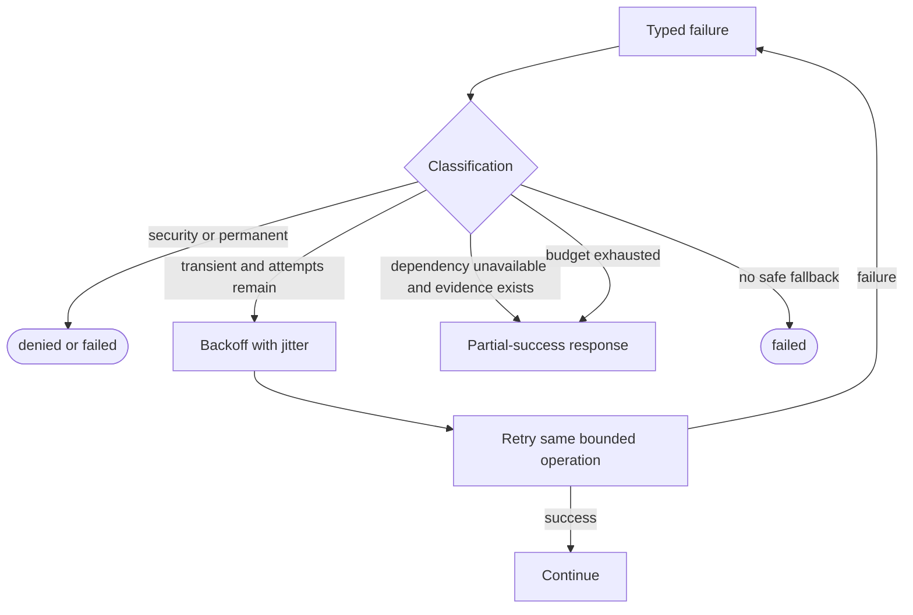

# Proposed LangGraph Design

Status: **Designed, not implemented.** LangGraph will provide explicit, testable state transitions and bounded fan-out/fan-in orchestration. It will not expose or require raw private chain-of-thought; explainability consists of route names, evidence identifiers, tool outcomes, budgets, warnings, and concise operational summaries.

## Typed state proposal

The eventual Python type may use `TypedDict` plus validated domain models. Fields are refined during contract implementation.

| Field group | Proposed fields | Purpose |
|---|---|---|
| Correlation | `request_id`, `trace_id`, `session_id` | Stable request, trace, and conversation identifiers. |
| Principal | `user_id`, `user_role`, `authorization_scope` | Immutable authenticated identity and backend-derived permissions. |
| Conversation | `messages`, `normalized_query`, `memory_context` | Bounded, role-labelled conversation input. |
| Routing | `detected_intent`, `task_complexity`, `route`, `search_plan` | Structured routing decisions without hidden reasoning. |
| Retrieval | `metadata_filters`, `retrieved_evidence`, `citations` | Authorized filters and provenance-carrying evidence. |
| Tools | `tool_requests`, `tool_results` | Proposed and authorized calls with public summaries. |
| Research | `intermediate_findings`, `recursion_depth`, `worker_results` | Isolated subtask outputs merged by deterministic reducers. |
| Control | `retry_counts`, `deadline`, `token_budget`, `current_status` | Global limits and lifecycle. |
| Assurance | `validation_results`, `warnings`, `errors` | Typed policy/evidence/output outcomes. |
| Response | `response_draft`, `final_response`, `memory_updates` | Draft, validated answer, and approved memory delta. |

Identity, authorization scope, original input, and budgets are write-protected after initialization. Parallel workers receive immutable snapshots plus worker-local fields; they cannot mutate parent evidence, identity, or final response.

## Node contracts

| Node | Responsibility | Reads | Writes |
|---|---|---|---|
| `authenticate_request` | Resolve and verify identity outside LLM control. | request credentials | principal or typed auth error |
| `enforce_rate_limit` | Consume from the authenticated user's token bucket. | user ID, request cost | rate-limit decision |
| `validate_input` | Validate size/schema and normalize the query. | messages | normalized query, validation result |
| `inspect_prompt_injection` | Detect direct injection indicators and assign policy action. | normalized query | validation result, warnings or denial |
| `load_memory` | Load authorized, bounded session context. | session/user IDs | memory context |
| `supervisor` | Classify intent/complexity and select a permitted route. | query, context, role | intent, complexity, route |
| `simple_retrieval` | Execute one authorized knowledge search for ordinary RAG. | query, filters, scope | retrieved evidence |
| `recursive_research_planner` | Decompose complex work into bounded, explicit subtasks. | query, budgets | search plan, worker tasks |
| `recursive_research_worker` | Run one isolated subtask using allowed retrieval/tools. | worker snapshot/task | worker-local finding/result/error |
| `aggregate_research` | Deduplicate, rank, and merge successful worker findings. | worker results | intermediate findings, evidence, warnings |
| `authorize_tool` | Check role, tool, arguments, data scope, and remaining budget. | principal, request, policy | authorized or denied request |
| `execute_knowledge_search` | Call authorized hybrid retrieval. | authorized query/filter | attributed evidence or error |
| `execute_python_analysis` | Submit a constrained job to the restricted runtime. | authorized dataset/operation | sanitized result or error |
| `execute_mcp_tool` | Invoke an allowlisted MCP capability. | authorized tool/arguments | validated result or error |
| `validate_evidence` | Reject unauthorized, malformed, duplicated, or instruction-bearing evidence. | evidence, scope | validated evidence, warnings/errors |
| `generate_response` | Draft a response using only validated evidence and results. | messages, findings, evidence | response draft, proposed citations |
| `validate_citations` | Ensure every citation maps to used, authorized evidence and supports a claim. | draft, evidence, citations | citation result or repair request |
| `apply_brand_guardrail` | Apply output policy and safe-response rules. | validated draft | final response or policy error |
| `update_memory` | Persist only approved session summary/delta. | final response, memory update | memory result/warning |
| `human_approval` | Pause risky configured operations for explicit approval. | action summary/policy | approval, denial, or expiry |
| `handle_failure` | Map typed errors to retry, partial, denied, or failed outcome. | errors, retry counts, evidence | status, public error, next route |

## Main graph (proposed)

Authentication, rate limiting, and coarse request validation may execute as FastAPI middleware/dependencies before graph creation; the named nodes represent the auditable logical stages and can start from their established results.

## Simple retrieval path

Ordinary top-k RAG performs one query/fusion pass and bounded response generation. It is preferred for latency, cost, and predictable evidence scope.

## Recursive research path

Recursive research differs from top-k RAG by creating multiple explicit subquestions, running bounded parallel evidence/tool work, assessing gaps, and optionally decomposing again. It is not unrestricted model recursion. Each batch uses at most 4 workers, default maximum recursion depth 2 (hard maximum 3), and a deterministic reducer.

## Tool authorization path

## Failure and retry path

## Routing, budgets, and isolation

- Conditional routing uses validated enums and policy functions, not arbitrary node names returned by an LLM.
- Default dependency retry maximum is 2 additional attempts for idempotent transient operations; LLM generation gets at most 1 retry. Security denials, invalid input, and permanent errors are never retried.
- A request has a monotonic deadline (proposed PoC: 60 seconds), a model-token budget, tool-call count, retrieval-call count, recursion limit, and worker concurrency limit. Each child receives a sub-budget; unused capacity may return to the parent.
- Workers return immutable result envelopes. Reducers accept only validated evidence and successful outputs. A failed worker adds a typed warning and cannot overwrite parent state or successful siblings.
- If sufficient evidence remains, failures produce `partial_success`; otherwise they produce `failed`. Authorization or policy rejection produces `denied`.
- Terminal states are `success`, `partial_success`, `denied`, `failed`, and `cancelled`. Completion is emitted once.
- Citation repair may regenerate once without new evidence. Evidence validation cannot be bypassed. Human approval pauses with an expiry and resumes from persisted public state.
