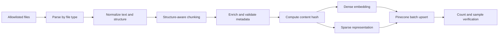

# Proposed Retrieval Design

Status: **The deterministic fictional source corpus, metadata manifest, benchmarks, and validation are implemented; parsing, chunking, embeddings, sparse encoding, Pinecone, fusion, and retrieval remain planned.** Retrieved documents are untrusted data.

## Offline ingestion

The source dataset contains 51 Markdown documents with YAML front matter and SHA-256 body hashes. The manifest is provider neutral and intentionally contains no chunk IDs, vectors, or Pinecone fields. Security fixtures are outside the valid manifest and must never enter normal ingestion.

Parsing rejects unsupported, oversized, encrypted, or malformed files. Normalization preserves headings and source offsets while removing unstable formatting. Structure-aware chunks target a configurable token range with small overlap; tables and section boundaries receive explicit handling. A deterministic `content_hash` supports idempotency, versioning, and deletion of superseded vectors. Dense embeddings and sparse term weights are generated offline and upserted together in bounded batches.

## Metadata schema

| Field | Type | Purpose |
|---|---|---|
| `document_id` | string | Stable source-document identifier. |
| `chunk_id` | string | Stable versioned chunk identifier. |
| `title` | string | User-visible document title. |
| `source` | string | Safe source locator or display label. |
| `department` | string | Organizational ownership/filter. |
| `document_type` | enum/string | Policy, report, guide, and similar classification. |
| `access_level` | enum | Coarse classification such as public, internal, restricted. |
| `allowed_roles` | list of role enums | Defense-in-depth role allowlist. |
| `created_date` | ISO date | Source creation date. |
| `updated_date` | ISO date | Source update date. |
| `version` | string | Source version. |
| `section` | string | Section heading/path. |
| `chunk_index` | integer | Deterministic order within a version. |
| `content_hash` | string | Integrity, idempotency, and duplicate key. |

All enumerated metadata is normalized against a controlled vocabulary. Raw confidential metadata is not returned to the UI or logs.

## Namespaces and authorization filters

The PoC namespace strategy is one namespace per logical corpus/environment, for example `assessment-dev-org`. Tenant separation, if added, must use distinct namespaces or indexes rather than role-only filtering. Document type, department, access level, allowed roles, version, and dates remain metadata filters.

The backend derives a mandatory authorization predicate from the authenticated principal. The client and LLM cannot supply or weaken it. The retrieval adapter combines it with validated user filters using logical AND, sends it to Pinecone on every dense/sparse query, and rechecks every returned record. Unauthorized records are discarded and raise a security audit signal. Only revalidated, authorized evidence can enter model context.

## Query and ranking pipeline

1. Normalize the query without changing its intent.
2. Resolve immutable namespace and mandatory role/access filters.
3. Produce dense query embedding and sparse query representation asynchronously.
4. Retrieve an expanded candidate set with Pinecone hybrid scoring.
5. Normalize scores, fuse rankings, deduplicate, and enforce per-document diversity.
6. Optionally rerank the small authorized candidate set.
7. validate untrusted content and attach evidence identifiers.
8. Return a bounded evidence set to the graph.

### Hybrid-ranking decision

| Approach | Advantages | Trade-offs |
|---|---|---|
| Weighted score combination | Single tunable `alpha`; natural fit for Pinecone hybrid vectors; efficient one-query PoC; preserves magnitude. | Dense/sparse score calibration matters; tuning can be corpus-specific. |
| Reciprocal Rank Fusion (RRF) | Robust to incomparable score scales; simple rank-based behavior. | Usually requires separate result lists, more requests/candidates, and discards score magnitude. |

**Decision:** use weighted score combination for the PoC, with an evaluation-set-tuned but configuration-controlled `alpha`. Record dense, sparse, and fused scores internally. Production may adopt RRF if evaluation shows unstable calibration across corpora or embedding upgrades. Optional reranking is a later bonus and operates only after authorization.

## Evidence, attribution, and defenses

Each evidence object carries `document_id`, `chunk_id`, safe title/source, section, version, content hash, retrieval scores, and exact text span. Citations use opaque evidence IDs assigned to the request, never model-invented URLs.

- **Unauthorized chunks:** server-derived namespace/filter before retrieval, post-query policy recheck, fail-closed on missing metadata.
- **Duplicate dominance:** collapse identical content hashes; cap chunks per document/section; use overlap-aware near-duplicate checks and diversity selection.
- **Hallucinated citations:** citation validator accepts only request evidence IDs and verifies claim support; unknown IDs trigger one repair or failure.
- **Unused evidence citations:** response generation records claim-to-evidence use; final validation removes unsupported/unused references and requires regeneration when material.
- **Malicious document instructions:** label and delimit evidence as untrusted data, scan for injection indicators, never permit retrieved text to alter policy/tools, and exclude or quarantine unsafe chunks while retaining an audit reason.

Retrieval quality tests will measure authorization precision (required 100%), citation validity, recall at k, nDCG/MRR where appropriate, duplicate rate, latency, and regression against a versioned mock query set.
